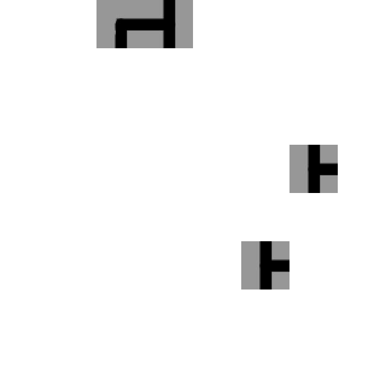

# Wave Function Collapse

Straight out of quantum mechanics, Wave Function Collapse is an algorithm for procedural generation of images.

  

## Note
The Algorithm determines the sides automatically (no need to hardcode the rules)